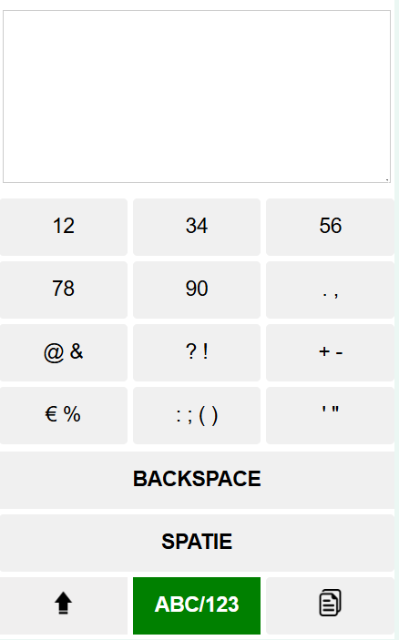

# Human centered design
 Project toetsenbord voor Eric

## Week 1: 
Uit alle informatie die op brightspace staat en online te vinden was over Eric en zijn beperkingen, waren niet echt genoeg voor mij om een beeld te krijgen van wat ik kon gaan maken. Dus de eerste dag heb ik niks kunnen verzinnen of maken. De tweede dag kwam Eric voor de kennis making en kregen we kans om vragen te stellen en zijn probleem en behoefte duidelijker in beeld te krijgen. 

Het probleem dat hieruit kwam is:

Als Eric in de trein zit legt hij zijn telefoon op zijn rolstoel. Het probleem is dat als de trein rijdt het erg veel beweegt, met als gevolg dat de rolstoel ook beweegt en daardoor Eric zelf ook en het bijna onmogelijk is voor hem om de kleine letters op zijn toetsenbord te raken. Hij kan hierdoor niet Whatsappen met mensen, niet notities maken of dingen opzoeken.

Hij heeft dus een manier nodig om makkelijker te kunnen typen in de trein, met alle beweging. 

Punten om op te letten zijn:
- Hij wilt liever geen prive berichten naar mensen inspreken.
- Niet teveel knoppen om de berichten of teksten te schrijven.
- Lange bewegingen zijn moeilijker, dus het liefst houden bij kortere bewegingen, zodat hij ook niet te lang zijn arm hoeft op te tillen. 
- Swipen om te typen is Eric geen fan van.
- Zo min mogelijk fouten moeten hoeven verbeteren want dat kost altijd veel tijd en moeite.

## Week 2:
Ik heb tijdens de ontmoeting met Eric vorige week dus heel veel aantekeningen, gemaakt en ben met het volgende idee gekomen voor het testmoment.
Zoals vroeger de toetsenborden op telefoons voordat deze touchscreens hadden, met 3 letters per knop. 
Het toetsenbord dat ik ontworpen heb heeft minder toetsen en ook veel grotere toetsen. Maar wel maximaal 3 letters per knop zodat er niet te vaak geklikt moet worden om een letter te typen. 

Dit lost wel het probleem op voor het bewegen in de trein, omdat de knoppen veel groter zijn dan de knoppen van een gewoon toetsenbord, maar het verdubbeld wel het aantal keer klikken voor een letter, dus tijdens de test moet er gekeken worden of dat meer klikken geen probleem is. Dingen zoals leestekens en cijfers zullen nog toegevoegd worden als blijkt dat het prototype een goed idee is.

Uit de test met Eric kwamen een aantal verbeterpunten:
- De knoppen waren nogsteeds te klein. Tijdens het bewegen van de metro, was te zien dat de knoppen nog steeds lastig te raken waren, als er 4 colommen waren. Hij had vooral moeite met de breedte van de knoppen, omdat hij van links naar rechts bewoog door het bewegen van de trein.
- Hij vond het ook lastig om in te schatten wanneer hij de knoppen nog kon indrukken om de letter te veranderen binnen de knop. Hij wilde dus graag en visuele feedback, om te zien of de knop al uitgelopen was of niet. 
- Daarnaast de voor de hand liggende dingen, zoals getallen, leestekens. Het tekstvak kon kleiner in de hoogte om daar ruimte voor te maken. Alle 
cijfers nog onder de letters zetten neemt waarschijnlijk teveel ruimte in, dus ik moet kijken naar een andere manier om te letters in beeld te brengen. 

Aanpassingen voor de tweede test:
Het toetsenbord is een stuk breder. Er zit geen witruimte meer aan de zijkanten van de toetsen, omdat dit onnodige ruimte inneemt die gebruikt kan worden voor de toetsen zelf. 
Daarnaast heb ik 3 colommen gevormt in plaats van 4, zodat de knoppen een stuk breeder worden en makkelijker te raken zijn als de trein beweegt. Er moeten dan wel meer letters in iedere knop en er moet dus meer geklikt worden, maar Eric zei tijdens de test dat dit geen probleem zou moeten zijn. 
Tot slot heb ik leestekens toegevoegd die het meest gebruikt worden. getallen staan er nog niet in, maar dat zal later komen, omdat we minder tijd hadden voor de 2e test.

## Week 3:

Deze week hadden we geen test met Eric, dus zijn we gaan testen in de trein met elkaar. 
De feedback die ik uit de test kreeg waren de volgende dingen:
- De knoppen kunnen iets meer hoogte krijgen, door het text vak te verkleinen en de ruimte onder het toetsenbord weg te halen. 
- Ik moest nog nummers toevoegen en had de leestekens onder de letters gezet, maar omdat er meer letters dan getallen zijn, konden de leestekens beter op het scherm met de getallen, zo namen deze minder ruimte in. 
- Er werd ook aangeraden om meerdere versies te maken van het toetsenbord om Eric zijn voorkeur te vragen. Ik heb de orginele versie dan een versie met 2 colommen in plaats van 3, zodat de knoppen nog groter zijn en een versie waarbij de actieve staat van de buttons nog langer is.

Daarnaast hadden we woensdag een weekly nerd over accesablility. Deze gaf ook handige punten om te verbeteren.
De feedback van welke knop nog actief was, was lichtblauw en hield zwarte letters. Het had dus een heel laag contrast.
Ik heb nu gemaakt dat als een button actief is, of als een checkbox checked is, dat de kleur groen wordt en de letters wit en bold, 
zodat deze veel beter te zien zijn op de afstand dat Eric zijn telefoon van zijn ogen heeft in de trein. 

Wat ik nu dus na de test heb toegevoegd zijn een paar dingen. 
- Duidelijkere feedback in de buttons en checkboxen.
- Hoger contrast voor interactie.
- Hogere knoppen en minder witruimte
- Een hidden toetsenbord met getallen en leestekens.

2 colommen versie.

Versie Einde week 3.

 

## Week 4:

Voor de laatste week is er niet veel meer aangepast. De verschillende versies die ik in week 3 gemaakt heb, heb ik getest met Eric en de volgende dingen zijn daaruit voort gekomen:

#### Positieve punten
- Het dubbel clicken ging makkelijk en vond Eric wel fijn gebruiken en 2 tekens per knop ook.
- Het formaat van de knoppen in de breedte leek hem nu wel goed genoeg, maar kon hij niet zeker weten zonder in de trein te testen.
- De copy knop vond hij een fijne functie om te hebben en het wisselen tussen letters en getallen met een knop onderaan ook.

#### Feedback voor aanpassingen
- De knoppen kunnen in de hoogte groter. Deze waren nog best dun en konden beter bijna vierkant, omdat er ook genoeg ruimte voor over was.
- Slider idee om tijd voor actieve knop zelf in te kunnen stellen
- Knoppen zijn tegelijk actief wat niet de bedoeling is, dus als een volgende letter ingedrukt wordt, wordt de vorige automatisch inactief.
- en knop om tussen verschillende layouts te kunnen wisselen (bijvoorbeeld de tweede versie met 2 kolommen)
- Als de capslock aanstaat veranderen de letters in de buttons niet van hoofdletters naar kleine letters. Alleen op de capslock knop was de actieve staat te zien.

### Hoogte buttons
Er was nog veel ruimte onder het toetsenbord over op zijn telefoon, wat ik niet had op mijn eigen. Eric zei dus dat de knoppen in de hoogte nog steeds wat dun waren en bijna vierkant mochten zijn als daar ruimte voor was.

### Actieve staat van meedere buttons
De feedback op de knoppen die ik toegevoegd had vond hij erg fijn, maar ik merkte zelf terwijl hij aan het testen was dat meerdere buttons tegelijk actief konden zijn en dit is niet handig voor als het typen wat sneller gaat. Het zou dus zo moeten zijn dat als een volgende button ingedrukt wordt, de vorige button automatisch op inactief gaat en die letter in de input niet nog aangepast wordt als er al een andere letter achterstaat.

### Timer actieve staat
Eric vroeg over de tijd van hoelang een button actief was, of dit op een manier door de gebruiker aangepast kon worden. Hier had ik zelf niet aangedacht. Ik had alleen gedacht om verschillende snelheden te testen, om te kijken wat Eric het fijnste vond, maar dat was dus een test voor in de trein geweest en dat ging niet door. Eric dacht dat het handig zou zijn dat er een slider of select zou komen voor de gebruiker om de snelheid aan te kunnen passen. 

### Layout aanpassen met checkbox
Voor de versie met 2 kolommen in plaats van 3, zei Eric dat hij niet wist of dat nodig was aangezien de test niet in de trein was en hij dus niet kon weten of de toetsen van de 3 kolommen breed genoeg waren, omdat hij dus niet het bewegen van de trein kon ervaren, maar dat het handig zou kunnen zijn, om tussen layouts te kunnen wisselen, and de hand van wat er makkelijker is voor de situatie. 

## Aangepast na laatste testmoment

Door de beperkte tijd heb ik niet alle punten van de feedback kunnen toepassen, maar een paar gekozen die wel optijd af waren voor de deadline. De eerste is de simpelste en dat is de maat van de buttons. 
De buttons zijn, bijna vierkant, maar niet helemaal, omdat dit te groot zou zijn voor het scherm. Wel zijn de ze een stuk groter weer dan dat ze eerst waren. 

Ten tweede heb ik ervoor gezorgt met een eventListener dat als de checkbox caps checked is, dat de textContent in de buttons hoofdletters zijn, zodat in de toetsen ook te zien is of het aan of uit staat.

## Extra functies als er meer tijd was

Als ik nog een week extra had voor dit project en misschien ga ik dat later alsnog toevoegen als ik er een keer aan toe kom om nog meer te oefenen met JavaScript, is ten eerste een slider op verzoek van Eric die de tijd van de actieve staat van buttons verandert, zodat als de gebruiker vind dat het te snel gaat of te langzaam deze dat heel simpel zelf kan aanpassen aan de hand van hun huidige voorkeur. Daarnaast een knop om de layout aan te kunnen passen, waarbij er een kolom minder in het toetsenbord zit, voor als bijvoorbeeld te trein op dat moment heel erg beweegt en nog breedere toetsen nodig zijn en als de trein stil staat voor beter overzicht het weer naar 3 kolommen kan gaan.